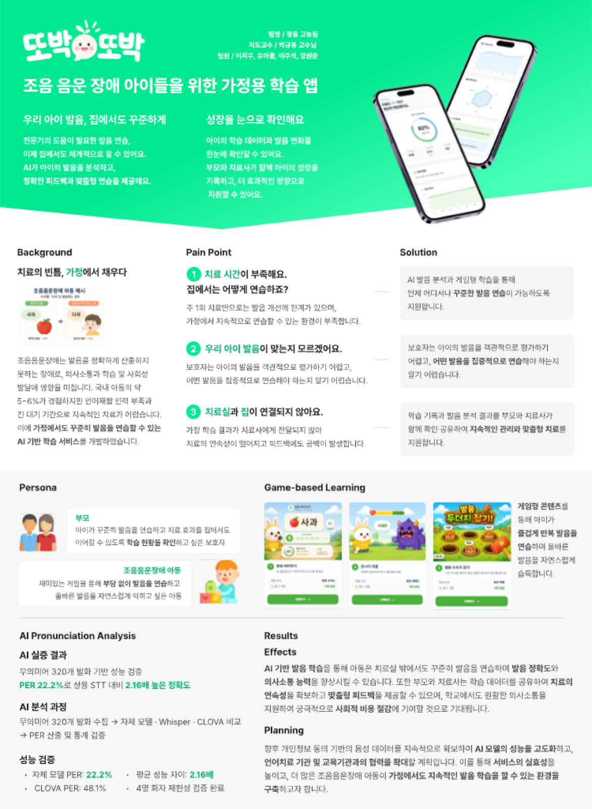
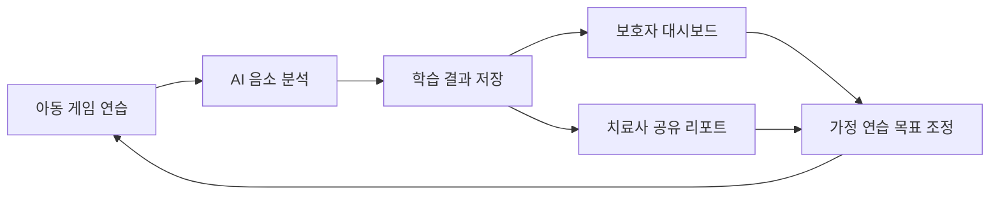
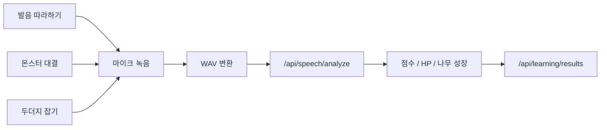
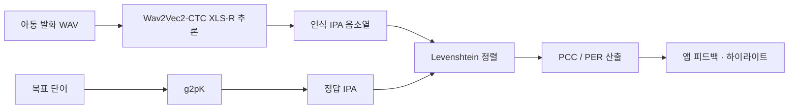
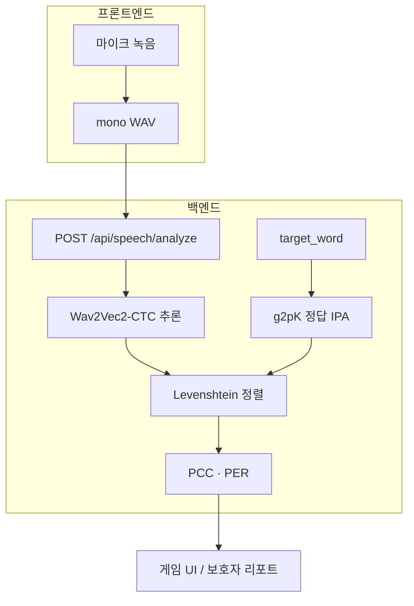

# 또박또박 (HOPE)

**조음·음운장애 아동을 위한 AI 기반 가정 학습 앱**

> 아이의 발음을 함께 듣는 시간 — 치료실과 가정 사이를 잇는 발음 연습 서비스

팀 **정융고능팀** · HOPE Project  
GitHub 저장소: [`dlwldn4824/ttobak-ttobak`](https://github.com/dlwldn4824/ttobak-ttobak) (표시명: 또박또박)

| 자료 | 링크 |
|------|------|
| 프로젝트 포스터 (미리보기) | [`docs/assets/ttobak-poster.png`](docs/assets/ttobak-poster.png) |
| 포스터 PDF (A4) | [`docs/presentations/또박또박_포스터_A4.pdf`](docs/presentations/또박또박_포스터_A4.pdf) |
| 발표자료 PDF | [`docs/presentations/또박또박_발표자료.pdf`](docs/presentations/또박또박_발표자료.pdf) |
| 기술 QA (발표용) | [`docs/presentations/또박또박_기술QA_수정본.docx`](docs/presentations/또박또박_기술QA_수정본.docx) |



---

## 왜 이 프로젝트를 했나요?

### 문제 배경

조음·음운장애(말소리장애)는 아동의 **의사소통·사회성 발달**에 직접적인 영향을 줍니다. 국내 아동의 약 **5~6%**가 해당 어려움을 겪는 것으로 알려지지만, 전문 언어치료사 부족과 긴 대기 때문에 **지속적인 치료·연습 기회**를 확보하기 어렵습니다.

현장에서는 보통 **주 1회 치료**가 이뤄집니다. 하지만 발음 교정은 반복 연습량이 핵심이라, 치료실 밖의 시간이 비어 있으면 효과가 크게 떨어집니다. 가정에서 “또박또박” 연습할 환경이 부족한 것이 핵심 공백입니다.

### 우리가 본 페인 포인트

1. **연습 시간 부족**  
   주 1회 클리닉 세션만으로는 발음이 일상으로 일반화되기 어렵습니다.

2. **보호자의 객관적 판단 어려움**  
   부모가 “지금 발음이 맞는지”, “어느 소리를 더 연습해야 하는지”를 스스로 평가하기 어렵습니다.

3. **가정 ↔ 치료실 데이터 단절**  
   집에서 한 연습 결과가 치료사에게 잘 전달되지 않아, 치료의 연속성이 끊깁니다.

### 우리가 만들려는 것

**또박또박**은 치료실을 대체하는 앱이 아니라, **가정 연습을 치료와 연결하는 보조 도구**입니다.

- 아이가 **게임으로** 부담 없이 발음을 반복 연습
- AI가 **음소 단위**로 객관 피드백 제공
- 보호자·치료사가 **성장 데이터**를 함께 보고 다음 목표를 맞춤



---

## 핵심 기능 (구현 상세)

### 1. 게임형 발음 학습

아이들은 “연습하라”는 지시보다 **놀이에 몰입**할 때 반복이 지속됩니다. 학습 허브(`/learning`)에서 세 가지 게임을 제공합니다.

| 게임 | 경로 | 연습 포인트 | 구현 요약 |
|------|------|-------------|-----------|
| **발음 따라하기** | `/learning/pitch` | 발음 유사도 | AI 예시 음성을 듣고 따라 말함. 통과 시 “오늘의 발음 나무”가 성장하고 사과가 쌓임 |
| **몬스터 대결** | `/learning/monster` | 발음 정확도 → 데미지 | 단어를 또렷하게 말해 몬스터를 공격. 제한 시간 내 미공격 시 버니 HP 감소 |
| **발음 두더지 잡기** | `/learning/whack` | 음운 변별·반응 | 1분 챌린지. 두더지가 올라오면 해당 단어를 말해 잡고 코인/보석 보상 |

공통 흐름:

1. 마이크 녹음 (`useSpeechRecorder`)
2. WAV 변환 후 `POST /api/speech/analyze`로 분석
3. 정확도·피드백을 게임 점수/HP/성장 UI에 반영
4. `POST /api/learning/results`로 학습 결과 저장



마스코트 **버니**와 밝은 UI로 치료실 긴장감을 낮추고, 보상(코인·보석·배지·상점)으로 동기를 유지합니다.

### 2. AI 발음 분석 — “무엇을 말했나”가 아니라 “어떻게 발음했나”

상용 STT(클로바, Whisper 등)는 언어모델이 **틀린 발음을 사전에 있는 단어로 보정**하는 경우가 많습니다.  
치료에서는 그 “틀린 지점”이 가장 중요한 정보인데, 보정되면 오류 데이터가 사라집니다.

또박또박의 분석 파이프라인은 다음을 목표로 설계했습니다.



**자체 개발한 부분**은 “모델 가중치 학습”이 아니라,  
**음소 정렬 + PCC/PER 산출 파이프라인**(치료사가 읽을 수 있는 숫자로 번역하는 층)입니다.

| 지표 | 의미 | 역할 |
|------|------|------|
| **PCC** (Percentage of Consonants Correct) | 목표 자음 중 정확히 발음한 비율 | 치료사·보호자가 읽는 임상 보조 지표 |
| **PER** (Phoneme Error Rate) | 삽입·삭제·치환을 포함한 음소 오류율 | 모델·시스템 성능 비교용 공학 지표 |

> PCC는 진단 확정이 아니라 **연습 중 변화를 추적하는 보조 지표**로 사용합니다. 최종 임상 판단은 치료사에게 있습니다.

백엔드(`/api/speech/analyze`)는 Speech Coach API와 동일한 multipart 요청을 받아 분석 결과를 프론트에 전달합니다.  
프론트는 `src/games/shared/useSpeechRecorder.ts`, `src/utils/speechApi.ts`에서 녹음·전송·결과 반영을 담당합니다.

### 3. 성장 기록 · 보호자 대시보드

가정 연습이 치료와 이어지려면 **데이터가 보여야** 합니다.

- **아이/학습자 측**
  - 홈 학습 현황, 학습 기록(`/history`)
  - 미션·보상(`/rewards`), 이벤트(`/events`)
  - 마이페이지·설정·가이드

- **보호자 측** (`/parent/*`)
  - 학습 요약·알림
  - AI 분석 리포트·음소 레이더·어려운 음소
  - 성장 차트(`/parent/growth`)
  - 치료사 공유(`/parent/therapist`)

포스터의 “눈으로 보는 성장” 콘셉트처럼, 정확도 추이·연습량을 차트로 보여 보호자가 다음 연습 초점을 잡도록 돕습니다.

### 4. 계정 · API · 연동

- 회원가입/로그인, JWT 기반 `Authorization`
- 홈·학습·기록·보상·설정 CRUD API (`backend/`)
- Swagger: `http://localhost:4000/docs`

데모 계정:

```text
identifier: demo
password: hope1234
```

---

## AI 모델 · 지표 · 검증 (발표 핵심)

> 발표·기술 QA 기준으로 정리한 내용입니다.  
> 자세한 슬라이드는 [`docs/presentations/또박또박_발표자료.pdf`](docs/presentations/또박또박_발표자료.pdf)를 참고하세요.

### 1) 모델: 사전학습 Wav2Vec2-CTC + 자체 파이프라인

| 구분 | 내용 |
|------|------|
| **사용 모델** | 사전학습 **Wav2Vec2-CTC** (XLS-R 백본) |
| **학습 여부** | **추가 학습(파인튜닝) 없이 추론**에 사용 |
| **자체 개발** | g2pK 정답 IPA 생성 → Levenshtein 음소 정렬 → **PCC·PER 산출** 파이프라인 |
| **추론 위치** | 서버 추론 (Node.js API 뒤 PyTorch). 단어 발화(1~2초) 기준 실시간 이하 |



왜 “자체 모델을 학습했다”고만 말하지 않나요?

- 조음음운장애 아동의 한국어 발화는 **치료사 검수 정답 라벨이 없는 상태**가 많습니다.
- 라벨 없는 데이터로 학습하면 오류 패턴을 정상으로 학습할 위험이 있습니다.
- 그래서 1단계는 **학습 없이 판별력이 나오는지** 확인하고,  
  실증에서 동의·치료사 라벨을 확보한 뒤 **재학습**하는 순서로 설계했습니다.

구조적으로 상용 STT와 다른 점:

- 상용 STT는 언어모델이 조음 오류를 **사전에 있는 단어로 보정**합니다.  
  (관측 예: “강토빼”→comtopet, “씨러티”→시리아, “빠차니”→부천)
- 치료에 필요한 것은 그 **틀린 음소 자체**이므로, 언어모델을 거치지 않고  
  Wav2Vec2-CTC로 **IPA 음소를 직접 출력**하는 구조를 택했습니다.

**g2pK가 필요한 이유**

- 한글은 표기와 실제 발음이 다를 수 있습니다. (예: “국물” → 실제 발음 [궁물])
- 표기 기준으로 채점하면 정상 발음도 오류로 잡힐 수 있어,  
  음운 규칙을 반영한 **목표 IPA**를 만든 뒤 비교합니다.

**음소 길이가 다를 때**

- Levenshtein을 “거리 숫자”만이 아니라 **정렬 경로**로 사용해  
  어느 위치의 음소가 삽입·삭제·치환됐는지 표시합니다.  
  (예: “사과”의 /s/는 정확 → 초록, “다과”로 말한 위치는 오류 → 빨강)

### 2) PCC · PER — 무엇을 보는 숫자인가

#### PCC (Percentage of Consonants Correct, 자음정확도)

- 정의: 전체 목표 **자음** 중 정확히 발음한 자음의 비율
- 출처: Shriberg & Kwiatkowski (1982) 등에서 쓰이는 **언어치료 현장 표준 지표**
- 중증도 구간(참고):

| PCC 구간 | 해석(참고) |
|----------|------------|
| 85~100% | 경도 |
| 65~85% | 경중도 |
| 50~65% | 중등도–중증 |
| 50% 미만 | 중증 |

**사용 원칙**

- PCC는 **진단 확정 도구가 아닙니다.**  
  연습 과정에서 변화를 추적하고 오류를 정량화하는 **보조 지표**입니다.
- 최종 임상 판단은 치료사가 합니다.
- 단어 하나(자음 2개)만 보면 PCC가 0/50/100처럼 튀므로,  
  서비스에서는 **미션·세션 단위로 누적**해 봅니다.

#### PER (Phoneme Error Rate)

- 삽입·삭제·치환을 **모든 음소**(모음 포함)에 대해 계산
- **역할 분담**: PCC = 치료사·보호자가 읽는 임상 소통용 / PER = 모델·시스템 비교용

### 3) 실험 설계 · 핵심 수치

> 현재 실험 화자는 **조음음운장애 아동이 아닙니다.**  
> 1단계는 “정발화 vs 오발화를 수치로 가를 수 있는가”를 본 **기술 PoC**입니다.

**실험 A — 정발화/오발화 판별 (PCC)**

- 의도적으로 통제한 **최소대립쌍**으로 정발화·오발화 비교
- 정발화 평균 PCC **94.7** / 오발화 평균 PCC **56.0**
- 평균 격차 **38.7p** (※ 정확도 38.7%가 아님)
- 샘플 규모는 PoC 수준(예: 144개 흐름 검증). 임상 완료를 의미하지 않음

**실험 B — 상용 STT 대비 (PER, 무의미어 320발화)**

| 시스템 | PER (↓ 좋을수록) |
|--------|------------------|
| **또박또박 파이프라인** | **22.2%** |
| OpenAI Whisper | 30.42% |
| NAVER CLOVA | 48.08% |

- 설계: 화자 4명 × 문항 40개 × 조건 2 → **320발화**
- 화자별 PER 편차 **약 2%p 이내** (특정 화자 의존이 아님을 확인)
- 통계: 대응표본 설계로 Wilcoxon signed-rank, Paired Bootstrap 수행
- 무의미어를 쓴 이유: 실재 단어는 상용 STT가 사전 보정 → 공정 비교가 어려움  
  (Gathercole & Baddeley 무의미어 따라말하기 과제 계열)

**해석 주의**

- PER 22.2%는 “받아쓰기 완벽”이 목표가 아니라,  
  **정발화/오발화 구분 + 조음 오류 보존**이 목표일 때의 상대 성능입니다.
- 오판 위험을 줄이기 위해: 세션 누적 평가 · 진단이 아닌 연습 피드백 · 치료사 최종 확인

선행연구 인용(자체 수치가 아님): Kim et al., JMIR 2025 —  
동일 계열 ASR로 한국 아동 말소리장애 평가 시 전문가 평정과 **ICC 0.984** 보고.  
→ “이 접근이 임상적으로 성립할 수 있다”는 **선례**로 인용.

### 4) 실증 기관 협력 · 다음 단계

| 단계 | 내용 |
|------|------|
| **현재** | 기술 PoC · 상용 대비 비교까지 완료 |
| **다음** | 동의 기반 **아동 발화 + 치료사 검수 라벨** 확보 후 임계값·재학습 |
| **협력 기관** | **햇살아래보듬이나눔이어린이집 부설 언어치료실** (실증 협력 확정) |


실증에서 다룰 계획:

1. 실제 아동 발화로 판별력·일반화 재검증 (화자 규모 확대)
2. 소음·마이크 등 가정 환경 조건 포함
3. 유음탈락·파찰음 등 약한 유형 가중 보완
4. 개인정보 처리방침·동의서 (원본 음성 최소화, 수치·음소열 위주 저장)
5. 현장 피드백 반영: **무발화·저발화** 아동에게 PCC를 억지로 쓰지 않고,  
   발성 시도·지속시간·참여 지표 중심의 별도 모드 검토

### 5) 서비스 포지셔닝 (규제·안전)

- **의료기기·진단 서비스가 아닙니다.** 중증도를 진단하지 않습니다.
- 앱은 치료실 밖 **연습·기록·시각화**를 돕고, 임상 판단은 치료사에게 둡니다.
- 아이 화면에서는 “틀렸다”를 노출하지 않고 재시도·격려 중심,  
  상세 수치는 보호자·치료사 화면에 누적 통계로 제공합니다.

---

## 기대 효과 · 앞으로의 계획

### 기대 효과

- 가정에서 **꾸준한 발음 반복** → 정확도·의사소통 자신감 향상
- 보호자의 **객관적 피드백** 부담 완화
- 치료사에게 가정 연습 데이터 공유 → **치료 연속성** 강화
- 대기·방문 부담을 일부 보완해 사회적 비용 완화에 기여

### 로드맵

1. **햇살아래보듬이나눔이어린이집 부설 언어치료실** 등과 현장 실증
2. 동의 기반 **아동 음성·치료사 라벨** 확보 후 모델/임계값 고도화
3. 치료사 리포트 형식·공유 UX 고도화
4. 무발화·저발화 모드 및 가정 소음 대응 강화
5. 더 지속 가능한 가정 학습 루틴(알림·미션·커리큘럼) 강화

---

## Tech Stack

**Frontend**

- React 19 + TypeScript + Vite
- Tailwind CSS v4
- React Router
- Chart.js (성장/분석 차트)

**Backend**

- Node.js `http` 서버 (`backend/`)
- Speech Coach API 연동 (`SPEECH_COACH_API_BASE`)

---

## Getting Started

```bash
# Frontend
npm install
npm run dev

# Backend (별도 터미널)
cd backend
npm start
```

- 프론트 기본: Vite dev server (`http://127.0.0.1:5173` 등)
- 백엔드 기본: `http://localhost:4000`

### Scripts

- `npm run dev` — 개발 서버
- `npm run build` — 프로덕션 빌드
- `npm run lint` — ESLint

배포 관련은 [`docs/DEPLOY.md`](docs/DEPLOY.md)를 참고하세요.

---

## 프로젝트 구조 (요약)

```text
src/
  games/          # pitch / monster / whack 게임
  pages/          # 홈·학습·기록·보상·보호자 대시보드
  components/     # UI 카드·차트·레이아웃
  utils/speechApi.ts
backend/          # REST API + speech analyze 프록시
docs/
  assets/         # 포스터 미리보기 이미지
  presentations/  # 발표·포스터 PDF
```

---

## 팀

**정융고능팀** — HOPE Project  
지도교수: 박규동 교수님

아이의 말이 또박또박 자라나도록, 가정과 치료실을 이어 갑니다.
